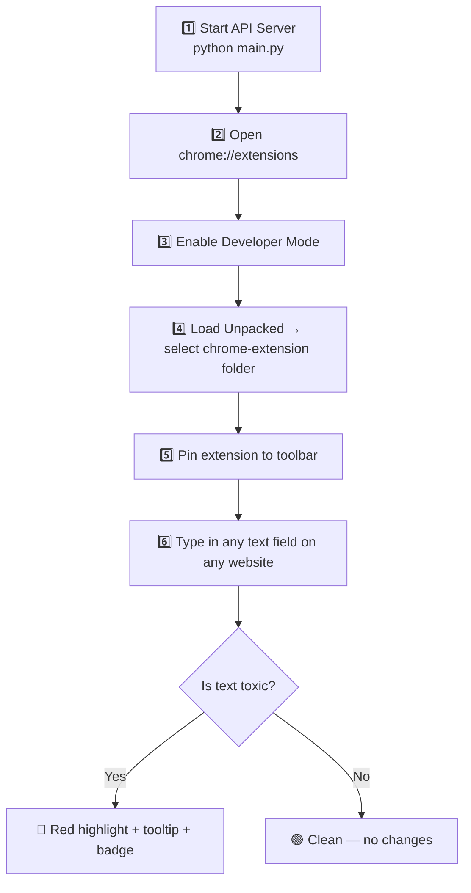

# 🛡️ Toxic Text Detector — Step-by-Step Setup Guide

---

## Step 1: Install Python Dependencies

Open a terminal in your project folder and install the required packages:

```bash
cd "R:\Projects\2_Deep_Learning_Projects\Toxic Text Detector using Deep Learning"
pip install -r requirements.txt
```

> [!NOTE]
> Your `requirements.txt` needs `fastapi`, `uvicorn`, `transformers`, `torch`, and `pydantic`. If any are missing, install them:
> ```bash
> pip install fastapi uvicorn transformers torch pydantic
> ``` 

---

## Step 2: Start the API Server

Run your FastAPI server — this is the AI backend that powers the extension:

```bash
python main.py
```

You should see output like:
```
Successfully loaded pre-trained model: unitary/toxic-bert
INFO:     Uvicorn running on http://0.0.0.0:8000
```

> [!IMPORTANT]
> **Keep this terminal open!** The server must be running for the extension to work. If you close it, the extension will show "API Offline" in the popup.

---

## Step 3: Open Chrome Extensions Page

1. Open **Google Chrome**
2. In the address bar, type:
   ```
   chrome://extensions
   ```
3. Press **Enter**

---

## Step 4: Enable Developer Mode

On the Extensions page, look at the **top-right corner**:

- Find the toggle switch that says **"Developer mode"**
- Click it to turn it **ON** (the toggle should turn blue)

Once enabled, you'll see three new buttons appear at the top:
- "Load unpacked"
- "Pack extension"  
- "Update"

---

## Step 5: Load the Extension

1. Click the **"Load unpacked"** button
2. A folder picker dialog will open
3. Navigate to:
   ```
   R:\Projects\2_Deep_Learning_Projects\Toxic Text Detector using Deep Learning\chrome-extension
   ```
4. Select the **`chrome-extension`** folder
5. Click **"Select Folder"**

You should now see **"Toxic Text Detector"** appear in your extensions list with the shield icon!

---

## Step 6: Pin the Extension to Toolbar

1. Click the **puzzle piece icon** 🧩 in Chrome's top-right toolbar (next to the address bar)
2. Find **"Toxic Text Detector"** in the dropdown list
3. Click the **pin icon** 📌 next to it

The shield icon will now always be visible in your toolbar!

---

## Step 7: Test It!

### ✅ Quick Test — Google Search Bar
1. Go to [google.com](https://www.google.com)
2. Click on the search bar
3. Type something normal: `hello how are you`
   - You should see a brief green "Text looks clean" pill in the bottom-right
4. Now type something toxic: `you are an idiot and I hate you`
   - The search bar will get a **red highlight**
   - A **tooltip** appears: "⚠️ This message may be toxic" with the toxicity score
   - A **red status pill** appears in the bottom-right
   - The extension icon shows a **red "!" badge**

### ✅ Test on Social Media
- Open **Twitter/X**, **YouTube comments**, **Reddit**, or any website
- Start typing in any comment box or text area
- Toxic text will be highlighted in real time

---

## Step 8: Use the Popup Dashboard

Click the **shield icon** in your toolbar to open the popup:

| Section | What It Shows |
|---|---|
| **Toggle Switch** | Turn detection ON/OFF. When OFF, status shows "Paused" |
| **Stats Cards** | Total scans, toxic detections, and last toxicity score |
| **Highlight Style** | Choose between 4 styles (Background, Underline, Color, Border) |
| **API Status** | Shows if your Python server is running (green = online, red = offline) |

### Changing Highlight Style
1. Open the popup
2. Click any of the 4 style buttons:
   - **Background** — soft red background tint (default)
   - **Underline** — wavy red underline like spell-check
   - **Color** — text turns red
   - **Border** — glowing red border around the field
3. The change applies instantly to all open tabs!

### Pausing Detection
1. Open the popup  
2. Toggle the switch **OFF**
3. Status changes to "Paused" (yellow dot)
4. All highlights are removed instantly
5. Toggle back **ON** to resume

---

## Troubleshooting

| Problem | Solution |
|---|---|
| **Popup shows "API Offline"** | Make sure `python main.py` is running in your terminal |
| **No highlighting on any site** | Check the popup — is the toggle ON? Is API online? |
| **Extension disappeared** | Go to `chrome://extensions` and re-enable it |
| **"This extension may have been corrupted"** | Click "Repair" on the extensions page, or reload unpacked |
| **First load is slow** | The Toxic-BERT model takes ~10-20 seconds to load on first run |
| **Doesn't work on some sites** | Some sites (like `chrome://` pages) block extensions. Try on regular websites |

> [!TIP]
> **Pro tip:** Open Chrome DevTools (`F12`) → Console tab to see `[ToxicDetector]` log messages for debugging.

---

## Summary Flow


