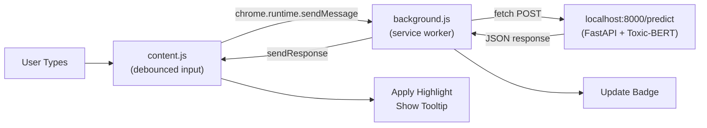

# 🛡️ Toxic Text Detector — Chrome Extension

A production-ready Manifest V3 Chrome extension that detects toxic text in real time as you type, powered by your **Toxic-BERT** AI model.

---

## 📁 Extension Structure

```
chrome-extension/
├── manifest.json      # Manifest V3 configuration
├── background.js      # Service worker — API proxy & badge management
├── content.js         # Content script — DOM monitoring & UI feedback
├── style.css          # Injected styles — highlights, tooltips, status pill
├── popup.html         # Extension popup — settings & stats dashboard
├── popup.js           # Popup logic — toggle, style picker, health check
├── popup.css          # Popup styles — premium dark glassmorphism theme
└── icons/
    └── icon128.png    # Extension icon
```

---

## 🚀 How to Load the Extension

1. **Start your API server** first:
   ```bash
   cd "r:\Projects\2_Deep_Learning_Projects\Toxic Text Detector using Deep Learning"
   python main.py
   ```
   The server runs on `http://localhost:8000`

2. **Load the extension in Chrome:**
   - Open Chrome → navigate to `chrome://extensions/`
   - Enable **Developer mode** (top-right toggle)
   - Click **"Load unpacked"**
   - Select the folder: `chrome-extension/`

3. **Start typing** in any text field on any website — the extension monitors in real time!

---

## ✨ Key Features

| Feature | Description |
|---|---|
| **Real-time Detection** | Monitors `<input>`, `<textarea>`, and `contenteditable` elements |
| **400ms Debounce** | Prevents excessive API calls while maintaining responsiveness |
| **MutationObserver** | Catches dynamically loaded content (SPAs, chat apps) |
| **4 Highlight Styles** | Background, Underline, Text Color, Border Glow |
| **Glassmorphism Tooltip** | Shows toxicity score + detailed category breakdown |
| **Floating Status Pill** | Real-time feedback in bottom-right corner |
| **Badge Indicator** | Red `!` badge when toxic text is detected |
| **Stats Dashboard** | Tracks total scans, detections, and last score |
| **API Health Check** | Popup shows live API connection status |
| **Persistent Preferences** | Toggle & style saved via `chrome.storage` |

---

## 🔧 Architecture



> [!IMPORTANT]
> API calls are proxied through `background.js` to avoid CORS restrictions that content scripts face. The content script never calls the API directly.

---

## 🎨 Highlight Styles

Choose from the popup settings:

| Style | Effect |
|---|---|
| **Background** | Soft red background tint + inner box-shadow |
| **Underline** | Wavy red underline (like spell-check) |
| **Color** | Changes text color to red |
| **Border** | Red border glow around the input field |

---

## ⚙️ API Integration

The extension is configured to work with your existing FastAPI server:

- **Endpoint**: `POST http://localhost:8000/predict`
- **Request**: `{ "text": "user input here" }`
- **Response**: `{ "is_toxic": bool, "toxicity_score": float, "detailed_scores": {...} }`

> [!NOTE]
> The extension also supports the `/predict_toxicity` endpoint for advanced analysis with toxic spans and sentiment detection.

---

## 🛡️ Error Handling

- If the API is unavailable → fails silently, no user disruption
- If the extension is reloaded → handles `runtime.lastError` gracefully
- All errors are logged to console with `[ToxicDetector]` prefix
- Network timeouts are handled with AbortSignal (5s timeout on health check)
